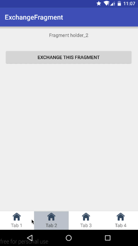

# BlogSourceCode
Source code of by blog. A set of demo project from my blog: http://kyleduo.com.

ExchangeFragment
===

Exchange fragment in FragmentTabHost.

Blog ==> [http://kyleduo.com/?p=789](http://kyleduo.com/?p=789)

Preview:

